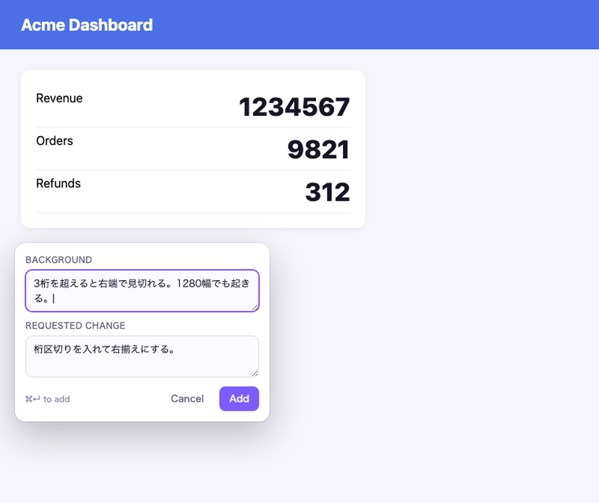
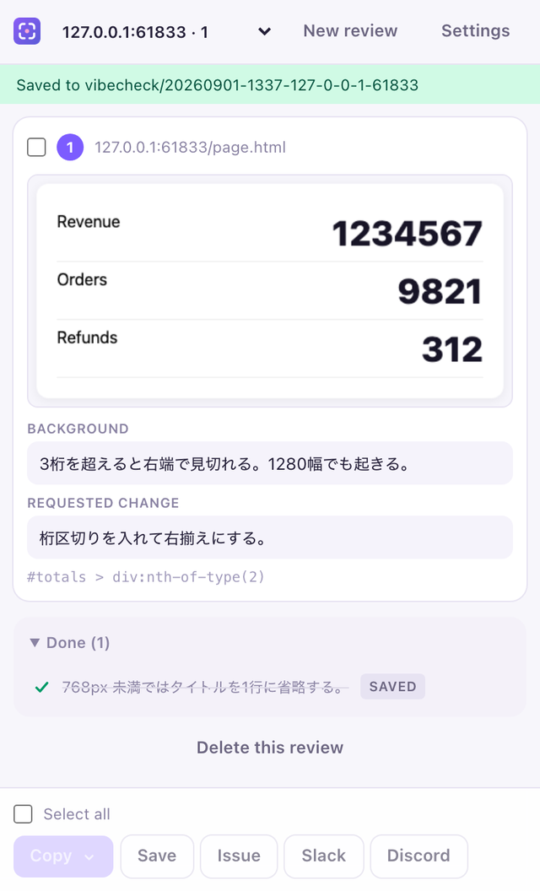
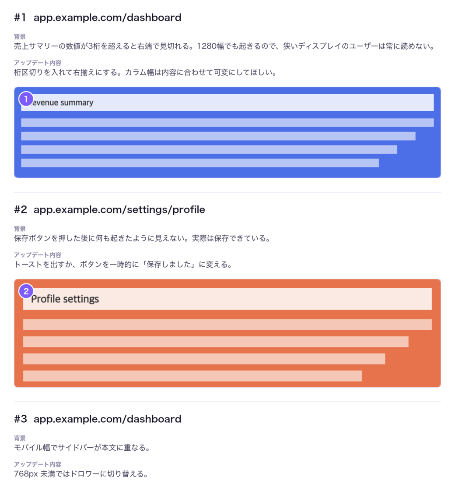

<div align="center">


# VibeCheck

**ウェブアプリをレビューし、直したい箇所をその場で切り取って、GitHub Issue / Slack / Discord / Markdown ファイルとして送り出す Chrome 拡張。**

[English README](README.md) · MIT · Chrome (Manifest V3)

</div>

---

## 何を解決するか

コードは AI が書けても、アプリを開いて目で見るのは人間の仕事です。そして気づくたびに同じ手作業が発生します。スクショを撮る、保存先を探す、背景を書く、直してほしい内容を書く、どこかに貼る。

VibeCheck は、この繰り返しを「2つのキー」と「2つの入力欄」に畳みます。

## 使い方

<table>
<tr>
<td width="52%"></td>
<td width="48%"></td>
</tr>
<tr>
<td align="center"><sub>ドラッグして、どうせ書く2つを書くだけ</sub></td>
<td align="center"><sub>送った指摘は消し込まれ、未対応だけが残る</sub></td>
</tr>
</table>

```
Cmd+J (Ctrl+J)   そのページでツールを起動
  S              ドラッグで範囲選択 → スクショ → 記入
  C              コメントのみ（スクショなし）
  Esc            終了
```

指摘はどれも同じ2項目 —— **背景**（なぜ気づいたか）と **アップデート内容**（どう変えてほしいか）—— を聞き、右のサイドパネルに積み上がります。チェックを入れて、送り先を選ぶだけです。

| 送り先 | 出力 |
| --- | --- |
| **コピー** | 選んだスクショを縦に並べて**番号を焼き込んだ1枚の画像**。Slack / Discord / GitHub / Notion のどこでも1回の貼り付けで読める |
| **保存** | スクショ一式と `review.md`（画像リンクは絶対パス）。Claude Code にそのまま渡せる |
| **GitHub** | Issue を1本。スクショは専用ブランチにコミットして本文から参照 |
| **Slack** | 本文と全スクショを1メッセージで投稿 |
| **Discord** | 同じことを Webhook 経由で |

コピー・保存・Issue・Slack・Discord のいずれかに送った指摘は、その場で消し込まれて
**対応済み** にたたまれます。リストには未対応のものだけが残り、パネルに見えている
番号がそのまま画像のバッジと本文の番号になります。「戻す」で未対応に戻せます。

### 「複数のスクショをまとめてコピー」について

OS のクリップボードは画像を**1枚しか**保持できません。これは Slack やブラウザの制約ではなく、どんなツールでも5枚のスクショを同時にクリップボードへ載せることはできません。

そこで VibeCheck は1枚に合成します。各スクショには、その指摘の文章と同じ番号が焼き込まれるので、1回の貼り付けでも「どの画像がどのコメントか」が崩れません。



## インストール

Chrome ウェブストアには未公開です。ビルドして「パッケージ化されていない拡張機能」として読み込んでください。

```bash
pnpm install
pnpm build
```

`chrome://extensions` を開き、**デベロッパーモード**をオンにして、**パッケージ化されていない拡張機能を読み込む** から `.output/chrome-mv3` を選択します。

読み込んだら `chrome://extensions/shortcuts` を確認してください。macOS の `Cmd+J` は Chrome 標準の「ダウンロード」と衝突するため、VibeCheck に割り当たらないことがあります。その場合は空いているキーを設定してください（未割り当てのときは拡張機能側からも案内します）。

## セットアップ

コピーと保存は設定不要です。以下の3つは、それぞれ認証情報が1つずつ必要です。

### GitHub

1. **Settings → Developer settings → OAuth Apps → New OAuth App** で OAuth App を作成します。Homepage / Callback URL は任意で構いません。
2. **「Enable Device Flow」に必ずチェックを入れます。** これがないとサインインが完了しません。
3. **Client ID** を VibeCheck の設定画面に貼り付けます。
4. 「接続する」を押し、GitHub 側に表示されるコードを入力すれば完了です。

クライアントシークレットもサーバーも使いません。ブラウザだけで完結できる唯一の方式である OAuth Device Flow を採用しています。

スクリーンショットは専用ブランチ（既定 `vibecheck-assets`）にコミットし、Issue 本文から参照します。GitHub API には Issue に画像を添付する公式エンドポイントが存在しないためです。

> **private リポジトリの場合:** GitHub の画像プロキシは private リポジトリの raw URL を取得できないため、スクショはインライン表示ではなくリンクになります。VibeCheck は Issue 作成後に合成画像をクリップボードへコピーし、その Issue を開くので、`Cmd+V` 一回で画像を貼り込めます。

### Slack

1. [api.slack.com/apps](https://api.slack.com/apps) で **From scratch** からアプリを作成します。
2. **OAuth & Permissions** で Bot Token Scopes に `chat:write` / `files:write` / `channels:read` / `groups:read` を追加します。
3. ワークスペースにインストールし、**Bot User OAuth Token**（`xoxb-…`）を設定画面に貼り付けます。
4. 投稿したいチャンネルに Bot を招待します。

Incoming Webhook はファイルをアップロードできないため、Slack だけは Bot Token が必要です。

### Discord

**サーバー設定 → 連携サービス → ウェブフック → 新しいウェブフック** で URL を発行し、設定画面に貼り付けるだけです。

## 権限について

画面を預ける道具なので、必要な権限とその理由を明示します。

| 権限 | 理由 |
| --- | --- |
| `activeTab`, `scripting` | キャプチャ用のオーバーレイは、**起動したタブにだけ**その場で注入します。全ページに常駐する content script はなく、「すべてのウェブサイトのデータの読み取りと変更」の警告も出ません |
| `storage`, `unlimitedStorage` | 指摘は `chrome.storage.local`、画像は拡張機能自身の IndexedDB に保存します |
| `downloads` | 「保存」機能 |
| `sidePanel`, `clipboardWrite` | サイドパネルと、合成画像のコピー |
| `api.github.com` / `github.com` / `slack.com` / `discord.com` へのアクセス | 上記4サービスのみ。送信ボタンを押したときだけ通信します |

送信ボタンを押すまで、データはどこにも送られません。トークンは端末内の `chrome.storage.local` に保存され、設定画面から削除できます。

## 開発

```bash
pnpm dev      # 監視ビルド。.output/chrome-mv3-dev を読み込む
pnpm test     # 純粋関数の単体テスト
pnpm compile  # 型チェック
pnpm build    # 本番ビルド
pnpm e2e      # 実際の Chrome を動かす通し確認 (e2e/README.md)
```

構成:

```
src/core/        純粋関数 — Markdown / Issue 本文 / クロップ / セレクタ / 合成レイアウト
src/services/    Chrome・IndexedDB・GitHub・Slack・Discord
src/ui/          共通 React 部品と、送信処理のオーケストレーション
src/entrypoints/ background worker・注入オーバーレイ・サイドパネル・設定画面
```

ドメインロジックは `src/core` に純粋関数として置き、テストを必ず書きます。ブラウザや通信に触れるものは `src/services` に閉じ込めます。純粋関数として表現できる振る舞いは `core` に、テストと一緒に追加してください。

アイコンは生成物です: `python3 scripts/make-icons.py`

## ライセンス

MIT
